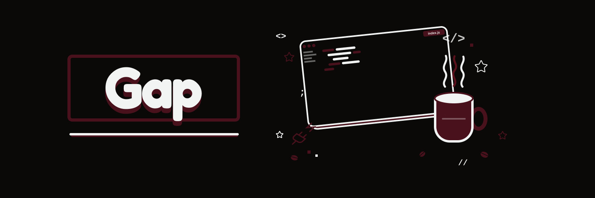

---

## Sobre mim

Olá, eu sou **Gap**.

Sou um desenvolvedor web em formação, focado em fortalecer meus fundamentos e transformar aprendizado em soluções bem estruturadas. Valorizo código claro, evolução constante e boas práticas de desenvolvimento.

`Desenvolvimento Web` · `Aprendizado Contínuo` · `Boas Práticas`

---

## Tecnologias

### Base

### Back-end e dados

### Ferramentas

---

## Em evolução

Estou aprofundando meus conhecimentos no ecossistema JavaScript, no desenvolvimento de APIs e na construção de aplicações web completas.

---

## Estatísticas

---

## Contato

Construindo o próximo capítulo com consistência, curiosidade e código.

