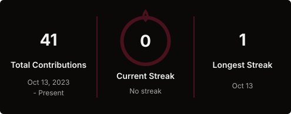

---

## About Me

Hi, I'm **Gap**.

I'm an aspiring web developer focused on strengthening my foundations and turning what I learn into well-structured solutions. I value clean code, continuous improvement, and thoughtful development practices.

`Web Development` · `Continuous Learning` · `Clean Code`

---

## Tech Stack

### Core Technologies

### Backend & Data

### Tools

---

## Currently Learning

I'm currently deepening my knowledge of the JavaScript ecosystem, API development, and building complete web applications.

---

## GitHub Stats

---

## Connect

Building the next chapter with consistency, curiosity, and code.

